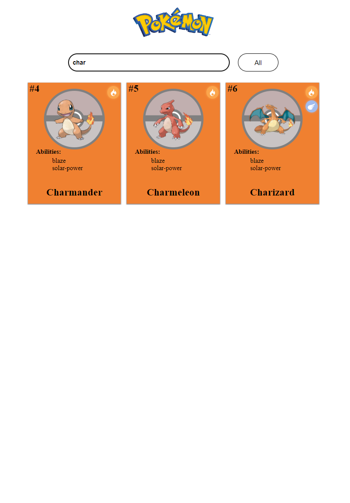

# PokemonApp
## About the Website
A simple website that uses the Pokemon API to display the first 150 Pokemon of the Pokedex.
Each Pokemon is displayed as a card and whenever the card is hovered it will display stats about that Pokemon such as 
HP and Attack.
When hovered each card has a "More Info" button that takes you to the details page that contains more information about the Pokemon.





## Recommended IDE Setup

[VSCode](https://code.visualstudio.com/) + [Volar](https://marketplace.visualstudio.com/items?itemName=Vue.volar) (and disable Vetur) + [TypeScript Vue Plugin (Volar)](https://marketplace.visualstudio.com/items?itemName=Vue.vscode-typescript-vue-plugin).

## Customize configuration

See [Vite Configuration Reference](https://vitejs.dev/config/).

## Project Setup

```sh
npm install
```

### Compile and Hot-Reload for Development

```sh
npm run dev
```

### Compile and Minify for Production

```sh
npm run build
```

### Lint with [ESLint](https://eslint.org/)

```sh
npm run lint
```
